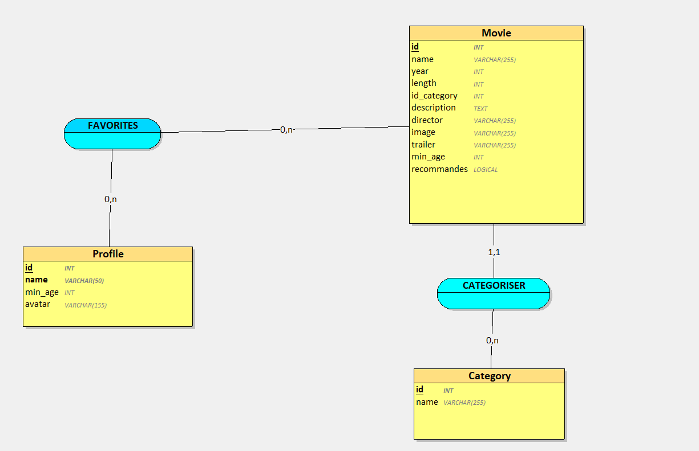

# Documentation Base de Données - SAE 2.03

## Architecture des Relations et Requêtes SQL

## Capture d'écran vue Looping:


### Itération 1 : Consultation des films
**Relations :**
- `Movie` → Première Entité
- Pas de relations complexes

**Requête :**
```sql
SELECT id, name, image 
FROM Movie;
```

**Justification :**
- Requête simple pour l'affichage de base
- Sélection optimisée des champs (id, name, image)
- Fondation pour les futures fonctionnalités

### Itération 2 : Ajout de films (Admin)
**Relations :**
- `Movie (1,1)` ―― `(0,n) Category`
- Un film appartient à une seule catégorie (obligatoire)
- Une catégorie peut contenir plusieurs films

**Requête :**
```sql
INSERT INTO Movie (
    name, director, year, length, description, 
    id_category, image, trailer, min_age
) VALUES (
    :name, :director, :year, :length, :description, 
    :id_category, :image, :trailer, :min_age
);
```

**Justification :**
- id_category comme clé étrangère
- Structure complète pour tous les attributs d'un film

### Itération 3 : Détails d'un film
**Relations :**
- Maintien de `Movie (1,1)` ―― `(0,n) Category`
- JOIN pour informations détaillées

**Requête :**
```sql
SELECT Movie.*, Category.name as category_name 
FROM Movie 
JOIN Category ON Movie.id_category = Category.id 
WHERE Movie.id = :id;
```

### Itération 4 : Films par catégorie
**Relations :**
- `Category (0,n)` ―― `(1,1) Movie`
- Perspective depuis la catégorie

**Requête :**
```sql
SELECT Movie.*, Category.name as category_name 
FROM Movie 
JOIN Category ON Movie.id_category = Category.id 
ORDER BY Category.name, Movie.name;
```

### Itération 5-6 : Gestion des profils
**Relations :**
- `Movie (0,n)` ―― `(0,n) Profile`
- Restriction d'âge intégrée au profil

**Requêtes :**
```sql
INSERT INTO Profile (name, avatar, min_age) 
VALUES (:name, :avatar, :min_age);

SELECT id, name, avatar, min_age 
FROM Profile;
```

### Itération 7 : Filtrage par âge
**Relations :**
- `Movie (1,1)` ―― `(0,n) Category`
- Filtrage des films selon l'âge de l'utilisateur

**Requête :**
```sql
SELECT Movie.*, Category.name 
FROM Movie 
JOIN Category ON Movie.id_category = Category.id 
WHERE Movie.min_age <= :age;
```

### Itération 8 : Modification des profils
**Relations :**
- Maintien des relations de l'itération 5-6

**Requête :**
```sql
UPDATE Profile 
SET name = :name, avatar = :avatar, min_age = :min_age 
WHERE id = :id;
```

### Itération 9-10 : Système de favoris
**Relations :**
- `Movie (0,n)` ―― `(0,n) Profile`
- A savoir que du à la relation n,n des liaisons "Favorites" devient une nouvelle table et prend les identifiants des tables Movie et Profile
- Table d'association Favorites

**Requêtes :**
```sql

INSERT INTO Favorites (profile_id, movie_id) 
VALUES (:profile_id, :movie_id);


DELETE FROM Favorites 
WHERE profile_id = :profile_id 
AND movie_id = :movie_id;
```

**Justification :**
- Relation n,n nécessitant une table d'association
- Un profil peut avoir plusieurs films favoris
- Un film peut être favori de plusieurs profils


### Itération 11 : Films mis en avant (Films Populaires)

**Objectif :**
Afficher une section "Films Populaires" sur la page d'accueil avec :
- Le titre du film
- L'affiche du film
- Un message si aucun film n'est disponible

**Base de données :**
- Utilisation de la table Movie existante
- Pas de modification de structure nécessaire

**Requête simple :**
```sql

SELECT id, name, image 
FROM Movie 
WHERE min_age <= :age 
LIMIT 5;
```